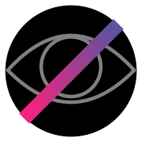

# What?
This is a mockup of the icon used by the "Anti Surveillance Syndicate" activist
group first introduced in
[episode 64](https://www.webtoons.com/en/sf/seed/episode-64/viewer?title_no=1480&episode_no=66)
of the [Seed](https://www.webtoons.com/en/sf/seed/list?title_no=1480) web-comic.

# Contributing
Contributions and improvements are welcome, just make sure to document the
changes in the CHANGELOG, respecting the existing formatting style.

# License
Currently, this work is licensed under a 
[Creative Commons Attribution-ShareAlike 4.0 International License](https://creativecommons.org/licenses/by-sa/4.0/).
**However,** this may change subject to whether the original creator of Seed
and/or (one of) their team wants me to. It is their original work after all. If
you are not okay with this possibility, please do not contribute.

